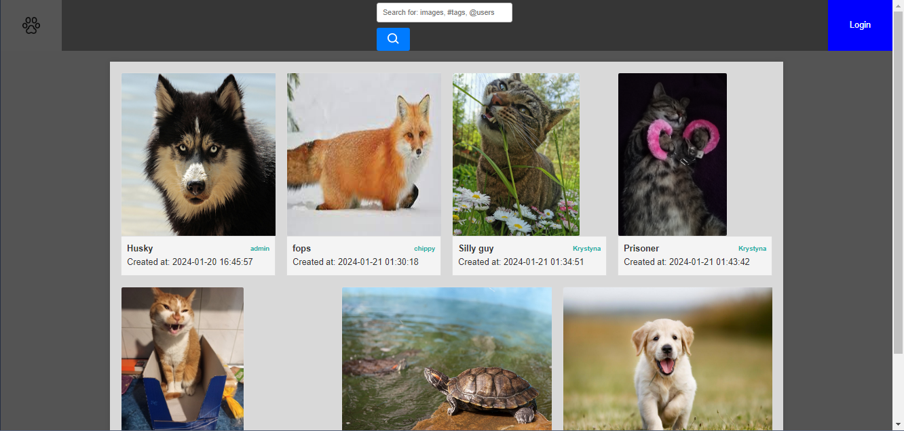
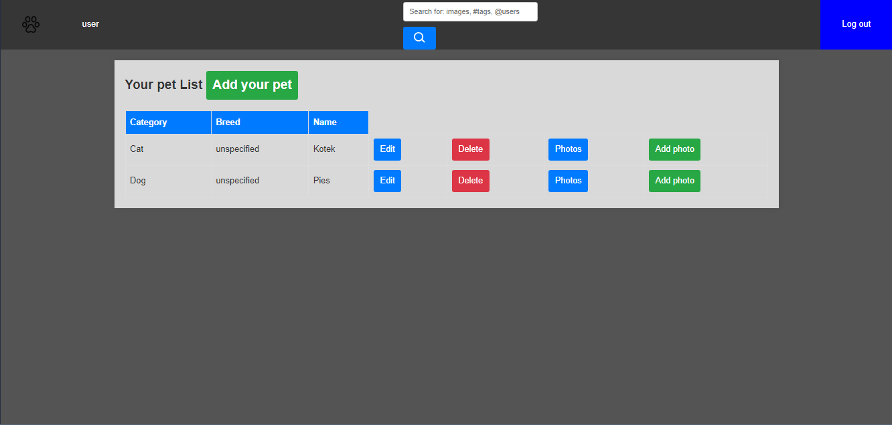
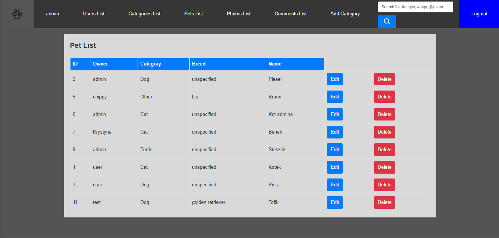

# Laravel project inspired by sites like Imgur.
It allows users to browse, add, and comment under photos.

There is a registration system using built-in laravel Auth library.

It also has support for both user and an administrator.

# It looks like this:

## Home Page:

## User Menu :

## Admin Page - pets list:
